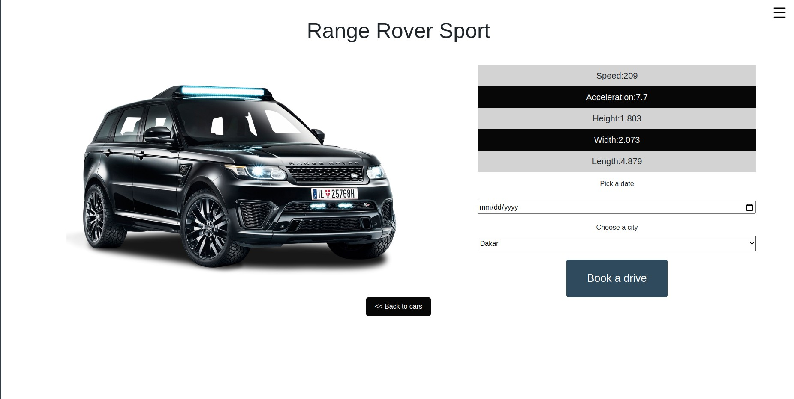

# Building a Recipe app with React & Redux.

## Technologies

- React
- Ruby on Rails
- React-DOM
- Create-React-App
- React Hooks
- React Router
- Eslint
- npm
- CSS
- Jest
- React Testing Library

## Live Version 
<a href="https://appointcar.netlify.app/" target="_blank" > Live version </a>

## Usage 
### Clone the project: 
 - git clone https://github.com/MouhaDiouf/appointment
 ### Run the project
 - to install the dependencies run the command : npm install 
 - after installation, run the command: npm start

## Description 
This is the last capstone project I built while being a software developer student at Microverse. It's a web application where the user can create an account, browse through available cars, and book cars for a date and location.

The web application uses React as the front-end language and Ruby on Rails as the back-end language. 

I built the Ruby On Rails backend API so that the two separate web apps can communicate smoothly.  

## Developed by

Mouhamadou Diouf ( <a href="https://github.com/MouhaDiouf"> @mouhad </a>)

Let's connect on: 

-  <a href="https://www.linkedin.com/in/mouha-diouf/" target="_blank" > LinkedIn </a>
- <a href="https://twitter.com/mouhamadiouf" target="_blank"> Twitter</a>

You can also check <a href="https://mouhadiouf.com/" target="_blank"> my portfolio </a>

## Potential Future Improvements 

- Create an admin dashboard to manage users (deletion, update, ect)
- Implement an auto-login using the browser cookies 

## Contributing

1. Fork it (https://github.com/MouhaDiouf/appointment-client)
2. Create your feature branch (git checkout -b feature/[choose-a-name])
3. Commit your changes (git commit -am 'What this commit will fix/add')
4. Push to the branch (git push origin feature/[chosen name])
5. Create a new Pull Request
